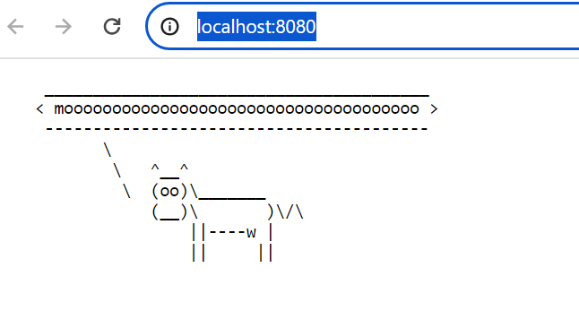

### Docker/nodejs
###### to run the build script:
###### Change directory to Docker folder and execute below
```chmod +x build.sh```
```./build.sh```

###### to run the Docker container:
``` docker run -p 8080:8080 -d node-js-app-image ```

###### you can browse it at localhost:8080

###### Sample output after executing
